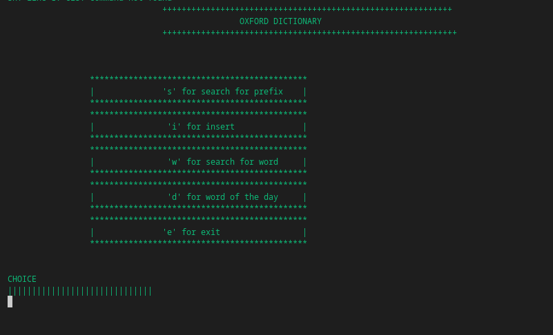

# Dictionary
this is the implementation of dictionary using trie data structure

This dictionary was made to fulfill the basic dictionary application and it provides the following features;

1. searching the prefix of any word
2. inserting any word not inside dictionary and/or replacing meaning of word or part of speech if needed 
3. searching specific word 
4. generating word of the day

(also has delete option in insert.cpp and can be used as additional option while designing in design.cpp )

to run this code:

1. need to have gcc compiler in the system
2. run this in the terminal:
*g++ insert.cpp design.cpp -o myprogram*
*./myprogram*

